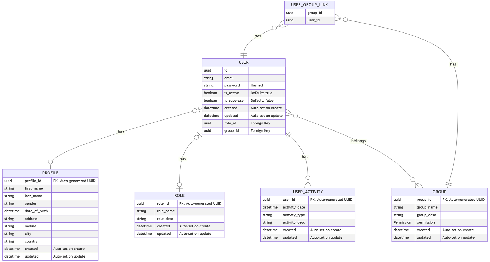

<p align="center">
  
</p>

<h1 align="center">FastAPI HTMX</h1>

<p align="center">
  Web App providing boilerplate implementation for user management, roles, groups, and CRUD operations using  HTMX, FastAPI and AlpineJS for rapid prototyping and without worrying for the user management.
</p>

## External Libraries Used

This project leverages several external libraries to provide a robust and efficient solution. Below is a brief description of each library along with a link to their documentation:

- [FastAPI](https://fastapi.tiangolo.com/) (v0.103.2): A modern, fast (high-performance), web framework for building APIs and serving HTML templates with Python 3.6+ based on standard Python type hints.
- [SQLAlchemy](https://www.sqlalchemy.org/) (v2.0.21): The Python SQL toolkit and Object Relational Mapper that gives application developers the full power and flexibility of SQL.
- [FastAPI Users](https://fastapi-users.github.io/fastapi-users/) (v12.1.2): Ready-to-use and customizable users management for FastAPI.
- [Uvicorn](https://www.uvicorn.org/) (v0.23.2): A lightning-fast ASGI server implementation, using `uvloop` and `httptools`.
- [AioSQLite](https://github.com/omnilib/aiosqlite) (v0.19.0): A library for SQLite with asyncio support.
- [Jinja2](https://palletsprojects.com/p/jinja/) (v3.1.2): A modern and designer-friendly templating language for Python.
- [HTTPX](https://www.python-httpx.org/): A next-generation HTTP client for Python.
- [NH3](https://github.com/Th3Whit3Wolf/nh3) (v3.1.2): A Python binding to the HTML sanitizer `h3`.
- [Alembic](https://alembic.sqlalchemy.org/en/latest/) (v1.13.1): A lightweight database migration tool for usage with the SQLAlchemy Database Toolkit.
- [AlpineJS](https://alpinejs.dev/) (loaded from CDN): A rugged, minimal framework for composing JavaScript behavior in your HTML templates.
- [Flowbite](https://flowbite.com/) (loaded from CDN): A component library built on top of Tailwind CSS for building modern web interfaces.
- [Pydantic](https://docs.pydantic.dev/2.0/) (v2.4.2): Data validation and settings management using Python type annotations.

## Features Implemented

- User Authentication and Authorization
- Role Management
- Group Management
- Dashboard for managing users, roles, and groups
- RESTful API endpoints for CRUD operations
- HTML templates for the web interface
- Database migrations with Alembic
- Unified error handling approach.

## To-Do (Future Enhancements)

- Implement Theming using Flowbite and Tailwind
- Implement a rate limiter to prevent abuse and ensure fair usage
- Integrate MinIO object storage for efficient file saving and management
- Add functionality to allow users to update their passwords
- Implement a password reset feature on the login page
- Implement rendering of blocks using FastAPI Fragment instead of reloading complete page or partials
- Develop a logging service to track and analyze user activity
- Implement CSRF protection to enhance security
- Integrate Turso database (SQLite) for production use
- Replace HyperScript code with Alpine JS
- Upgrading the boilerplate code to work with Python 12 and HTMX 2
- Fixing the GUI issues appearing in mobile view

## Demo

<p align="center">
  
</p>

## Setting Up the Project

### Creating the `.env` File

Create a `.env` file in the root directory of the project and add the following environment variables:

```
DATABASE_URL="sqlite+aiosqlite:///./users.db"
SECRET_KEY=your_secret_key
```

Replace `your_secret_key` with a strong secret key for your application.

### Running the Project

1. **Clone the repository:**

   ```sh
   git clone https://github.com/yourusername/project-management.git
   cd project-management
   ```

2. **Install dependencies:**
   If you are using `poetry`, run:

   ```sh
   poetry install
   ```

   If you are using `pip`, run:

   ```sh
   pip install -r requirements.txt
   ```

3. **Run database migrations:**

   ```sh
   alembic upgrade head
   ```

4. **Run database migrations:**

   ```sh
   alembic revision --autogenerate -m "Initial migration"
   ```

5. **Insert Required import in Migration File:**

   After generating the initial migration, open the newly created revision file in app/migrations/versions/ and add the following imports at the top of the file:

   ```sh
   import fastapi_users_db_sqlalchemy.generics
   import app.models.groups

   ```

6. **Apply the changes:**

   ```sh
   alembic upgrade head
   ```

7. **Start the application:**
   If you are using `poetry`, run:

   ```sh
   poetry run uvicorn main:app --reload
   ```

   If you are using `uvicorn` directly, run:

   ```sh
   uvicorn main:app --reload
   ```

8. **Access the application:**
   Open your web browser and navigate to `http://127.0.0.1:8000`.

## Updating Model References in `init_models`

When you define a new **Database model** in your application, it's essential to update the `init_models` function to ensure that Alembic can detect and generate migrations for this new model correctly. This step is crucial for maintaining the integrity of your database schema and ensuring that all models are correctly versioned.

### Steps to Update `init_models`

1. **Locate `init_models` Function**: Open the `base.py` file in `app/models/base.py`. This file contains the `init_models` function, which is responsible for importing all the models in your application.

2. **Add New Model Import**: Once you have defined a new model in your application, you need to import it in the `init_models` function. Ensure that you follow the existing import structure. For example, if your new model is `Invoice` and it's located in the `models.financial` module, you would add the following line:

   ```python
   from ..models.financial import Invoice  # noqa: F401
   ```

   The `# noqa: F401` comment at the end of the import statement tells the linter to ignore the "imported but unused" warning, as the import is necessary for Alembic to detect and generate migrations for the model.

3. **Follow Import Conventions**: If you have multiple models in the same module, you can import them in a single line to keep the `init_models` function organized. For example:

   ```python
   from ..models.financial import Invoice, Payment, Transaction  # noqa: F401
   ```

4. **Save Changes**: After adding the import statement for your new model, save the changes to the `base.py` file.

5. **Generate Alembic Migration**: With the new model imported in the `init_models` function, you can now generate an Alembic migration script that includes this model. Run the Alembic command to autogenerate a migration:

   ```bash
   alembic revision --autogenerate -m "Added new model Invoice"
   ```

6. **Review and Apply Migration**: Always review the generated migration script to ensure it accurately represents the changes to your models. After reviewing, apply the migration to update your database schema:

   ```bash
   alembic upgrade head
   ```

## Project Structure

Below is an overview of the project structure for application. This structure is designed to organize the application's components logically, making it easier to navigate and maintain.

```bash
FastAPI-HTMX/
├── app/
│ ├── core/ # Core application logic and utilities
│ ├── database/ # Database configurations and connections
│ ├── migrations/ # Alembic migration scripts
│ ├── models/ # SQLAlchemy ORM models
│ ├── routes/ # API route definitions
│ │ ├── api/ # API endpoints
│ │ └── view/ # View routes for web interface
│ │ └── view_crud.py # SQLAlchemyCRUD class for database operations
│ ├── schema/ # Pydantic schemas for data validation
│ │ └── pydantic_base.py # Pydantic partial model decorator
│ ├── static/ # Static files (CSS, JS, images)
│ └── templates/ # Jinja2 HTML templates
├── tests/ # Unit and integration tests
├── alembic.ini # Alembic configuration file
├── main.py # Application entry point
├── poetry.lock # Poetry lock file for dependencies
├── pyproject.toml # Project configuration and dependencies
└── README.md # Project documentation
```

## ER Diagram

Here's the Entity-Relationship (ER) diagram for database:



## Contributing

Contributions are welcome! Please open an issue or submit a pull request for any changes.

## ER Diagram

Here's the Entity-Relationship (ER) diagram for database:


## License

This project is licensed under the MIT License. See the [LICENSE](LICENSE) file for details.
